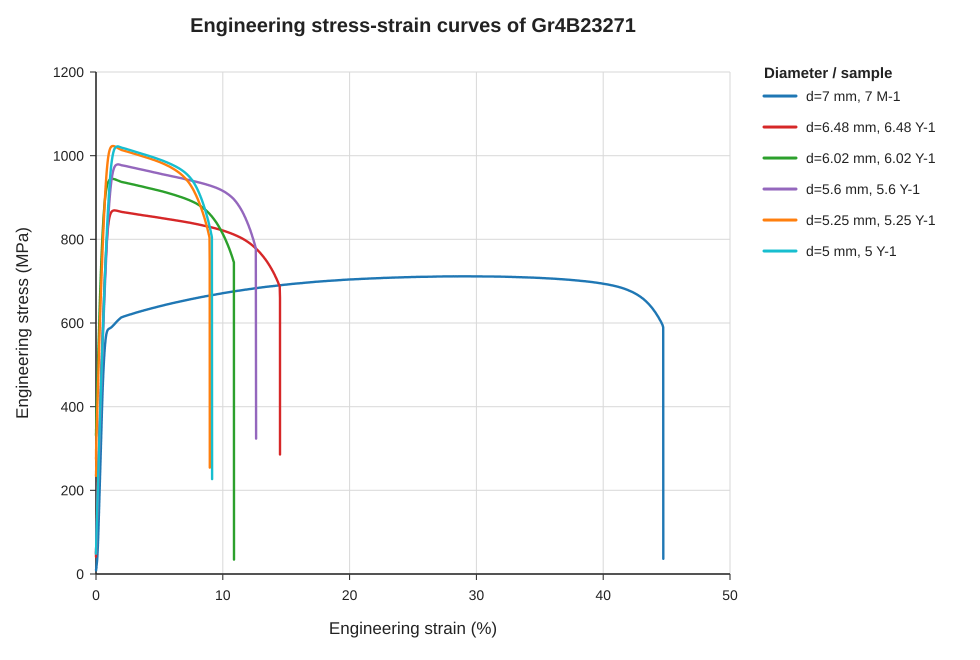
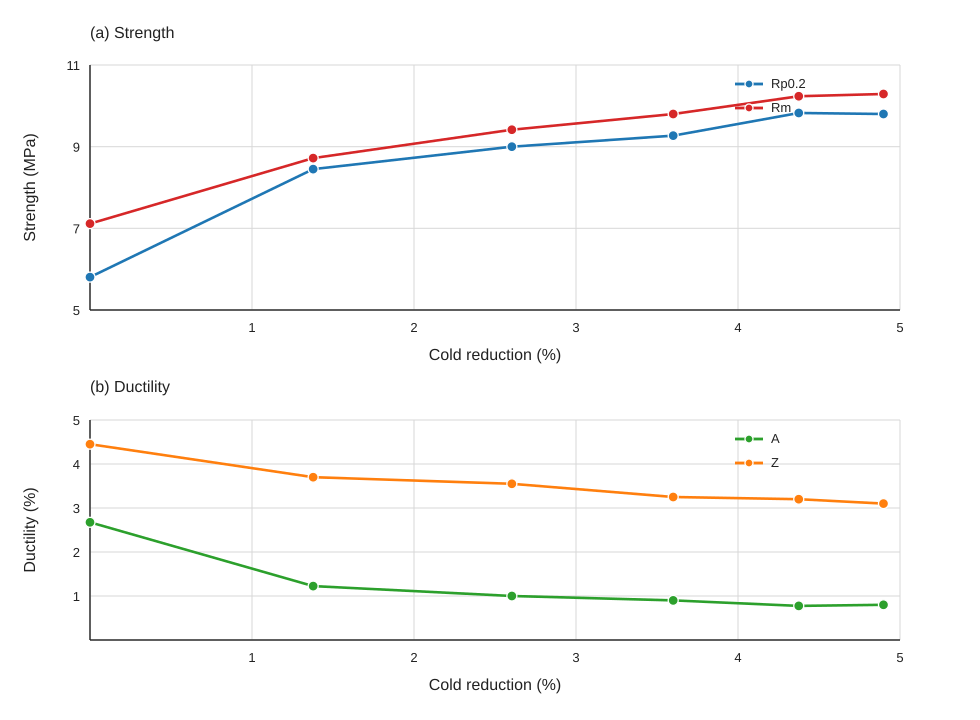
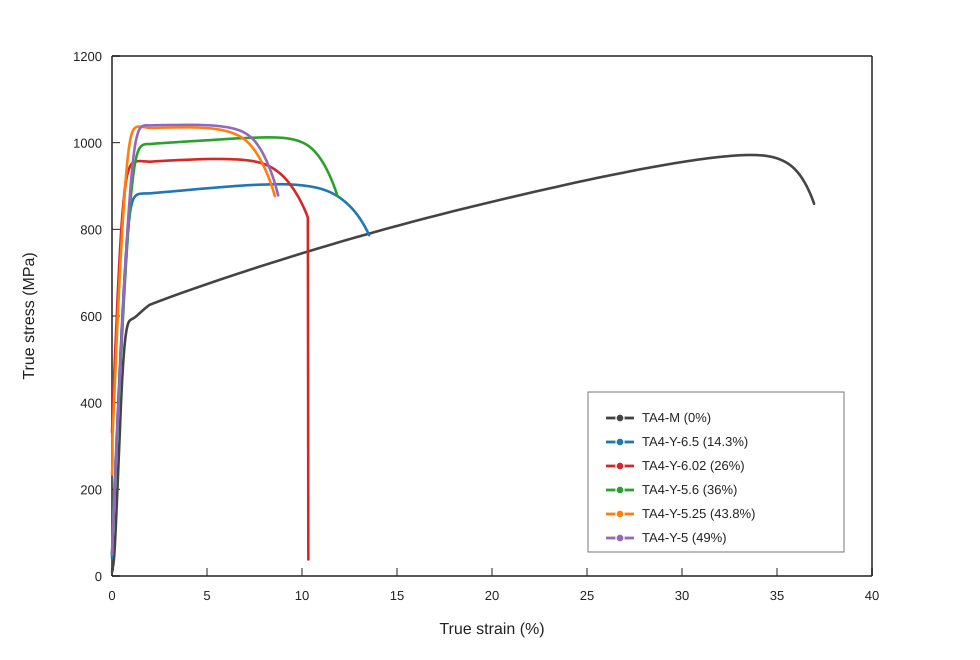

# 旋锻冷变形对 TA4 商业纯钛加工硬化行为与组织机制的影响

## 摘要

目的  【待写】针对 TA4 商业纯钛冷变形强化过程中强度提升、塑性变化及加工硬化机制尚需进一步阐明的问题，说明本文研究目的。

方法  【待写】说明采用不同旋锻变形量样品，结合拉伸试验、真实应力-应变分析、加工硬化率计算、金相组织观察和 EBSD 表征开展研究。

结果  【待写】概述屈服强度、抗拉强度、延伸率和加工硬化行为随冷变形量的变化，并说明主要金相/EBSD 观察结果。

结论  【待写】归纳 TA4 商业纯钛冷变形强化的主要机制，注意将位错积累、晶界/亚晶界作用、取向或织构演化等结论限定在数据支持范围内。

关键词：TA4；商业纯钛；旋锻；冷变形；加工硬化；EBSD

## Work Hardening Behavior and Microstructural Mechanism of Rotary-swaged TA4 Commercially Pure Titanium

ABSTRACT: 【To be written after the Chinese abstract is finalized. Keep the same purpose-method-results-conclusion logic as the Chinese abstract.】

KEY WORDS: TA4; commercially pure titanium; rotary swaging; cold deformation; work hardening; EBSD

## 引言

【待写】参考《7075 高强铝合金构件冷成形强化机制研究》的写法，本部分不单独分成多个小节。建议按“材料应用背景和性能需求 -> 冷变形/旋锻强化研究现状 -> 现有研究不足 -> 本文研究对象、方法和目的”的顺序展开。

【待写】可写明：本文以 TA4 商业纯钛为研究对象，分析不同旋锻冷变形量下拉伸性能、加工硬化行为和显微组织演化之间的关系，以阐明冷变形诱导强度提升及塑性变化的组织机制。

## 1 试验

选取 12 根初始直径为 7 mm 的 TA4 商业纯钛棒材为研究对象。其中 2 根棒材保留原始状态，记为 TA4-M；其余棒材经室温旋锻冷变形加工至不同直径，记为 TA4-Y-d，其中 d 表示旋锻后的名义直径，单位为 mm。依据实验室拉伸数据中的直径分组，旋锻后样品直径分别为 6.5、6.02、5.6、5.25 和 5.0 mm，各直径组包含 2 根平行样品。因此，旋锻态样品分别记为 TA4-Y-6.5、TA4-Y-6.02、TA4-Y-5.6、TA4-Y-5.25 和 TA4-Y-5.0。

冷变形量按棒材截面积缩减率计算，如式（1）所示：

```text
ε = (A0 - A1) / A0 × 100% = (D0^2 - D1^2) / D0^2 × 100%    （1）
```

式中，A0 和 A1 分别为旋锻前、后的横截面积，D0 和 D1 分别为旋锻前、后的棒材直径。以 D0 = 7 mm 作为参考直径计算，各样品组的冷变形量分别为 0、13.78%、26.04%、36.00%、43.75% 和 48.98%。

对不同状态的棒材进行室温单轴拉伸试验，获得工程应力-应变曲线，并统计 0.2% 偏移屈服强度、抗拉强度、断后伸长率和断面收缩率。为进一步分析拉伸变形过程中的加工硬化行为，在均匀塑性变形阶段将工程应力-应变数据换算为真实应力-真实应变数据，并据此计算加工硬化率。每个直径组设置 2 个平行试样，结果以平均值表示；对于弹性段不清晰、0.2% 偏移屈服点无法可靠确定或曲线异常的结果，在后续数据分析中保留可靠性标记，并结合原始曲线进行判别。

为分析旋锻冷变形对 TA4 商业纯钛组织演化的影响，分别选取 TA4-M 及不同 TA4-Y-d 样品进行金相观察和 EBSD 表征。金相样品经切取、镶嵌、磨抛和腐蚀后，用于观察不同变形量下晶粒形貌、变形流线和组织均匀性。EBSD 表征用于获得不同状态样品的取向分布、晶界特征、局部取向差及织构演化信息，并与拉伸性能和加工硬化行为相结合，分析旋锻冷变形诱导的强化机制。

## 2 结果与分析

### 2.1 不同冷变形量下 TA4 的力学性能

根据室温单轴拉伸试验获得的载荷-位移数据，结合试样原始截面积和标距换算得到工程应力-应变曲线。为比较不同冷变形量下 TA4 商业纯钛的拉伸响应，选取各样品组的代表性工程应力-应变曲线进行汇总，如图 1 所示。由图 1 可见，未变形样品 TA4-M 的应力水平较低，断裂前具有较长的塑性变形阶段；经旋锻冷变形后，各样品曲线整体向高应力水平移动，且屈服后的塑性变形区间明显缩短。该结果表明，旋锻冷变形提高了材料抵抗塑性变形的能力，同时降低了后续拉伸过程中的塑性变形空间。



图 1 不同冷变形量 TA4 商业纯钛样品的工程应力-应变曲线

由工程应力-应变曲线获得的主要力学性能参数见表 1。表中结果为各样品组的平均值。随冷变形量由 0 增加至 48.98%，TA4 商业纯钛的屈服强度由 580.5 MPa 提高至 980.0 MPa，抗拉强度由 711.5 MPa 提高至 1029.0 MPa，说明旋锻冷变形显著提高了材料的屈服抗力和最大承载能力。与此同时，断后伸长率由 26.75% 降低至 8.00%，断面收缩率由 44.5% 降低至 31.0%，表明材料整体塑性和断裂前局部塑性变形能力均随冷变形量增加而下降。

表 1 不同冷变形量 TA4 商业纯钛样品的力学性能

| 样品名称 | 冷变形量/% | 屈服强度 Rp0.2/MPa | 抗拉强度 Rm/MPa | 断后伸长率 A/% | 断面收缩率 Z/% |
|---|---:|---:|---:|---:|---:|
| TA4-M | 0.00 | 580.5 | 711.5 | 26.75 | 44.5 |
| TA4-Y-6.5 | 13.78 | 845.0 | 872.0 | 12.25 | 37.0 |
| TA4-Y-6.02 | 26.04 | 900.0 | 941.5 | 10.00 | 35.5 |
| TA4-Y-5.6 | 36.00 | 927.0 | 980.0 | 9.00 | 32.5 |
| TA4-Y-5.25 | 43.75 | 982.5 | 1023.5 | 7.75 | 32.0 |
| TA4-Y-5.0 | 48.98 | 980.0 | 1029.0 | 8.00 | 31.0 |

为进一步体现强度和塑性指标随冷变形量的变化规律，将屈服强度、抗拉强度、断后伸长率和断面收缩率绘制于同一图中，如图 2 所示。由图 2(a) 可见，屈服强度和抗拉强度均随冷变形量增加而整体升高，其中抗拉强度保持较为连续的上升趋势；屈服强度在 43.75% 和 48.98% 冷变形量之间出现局部差异，说明高变形量区间的屈服响应存在一定非单调变化。由图 2(b) 可见，断后伸长率和断面收缩率整体下降，反映出冷变形强化过程伴随塑性储备降低。上述强度和塑性指标的相反变化说明，旋锻冷变形能够有效提高 TA4 商业纯钛的强度，但其强度提升以牺牲部分塑性变形能力为代价。



图 2 不同冷变形量 TA4 商业纯钛样品的力学性能指标变化：（a）强度指标；（b）塑性指标

### 2.2 真实应力-应变曲线与加工硬化行为

工程应力-应变曲线能够反映不同冷变形量样品的宏观拉伸响应，但加工硬化行为需要结合真实应力-真实应变关系进一步分析。根据工程应力-应变数据换算得到代表性真实应力-真实应变曲线，如图 3 所示。与工程应力-应变曲线相比，真实应力-真实应变曲线更能反映均匀塑性变形阶段材料流动应力随应变增加的变化特征。



图 3 不同冷变形量 TA4 商业纯钛样品的真实应力-真实应变曲线

由图 3 可见，冷变形样品在拉伸初期即表现出较高的真实应力水平，说明预先旋锻变形已使材料处于较高的加工硬化状态。随着冷变形量增加，曲线可持续发展的真实应变范围缩短，表明高变形量样品在后续单轴拉伸过程中可继续储存位错并发生均匀塑性变形的空间受到限制。根据真实应力-真实应变曲线计算得到的加工硬化率 theta = d sigma / d epsilon 如图 4 所示。由图 4 可见，各样品加工硬化率随真实塑性应变增加整体呈下降趋势；冷变形量较高的样品曲线分布区间明显缩短，说明预变形后材料的后续加工硬化空间降低。


图 4 不同冷变形量 TA4 商业纯钛样品的加工硬化率曲线

### 2.3 显微组织与 EBSD 特征

为分析力学性能变化的组织来源，需要结合金相组织和 EBSD 表征结果讨论冷变形引起的微观组织演化。不同冷变形量样品的金相组织见图 5【待补】。金相结果可用于比较 TA4-M 与不同 TA4-Y-d 样品的晶粒形貌、变形流线和组织均匀性，从而分析旋锻冷变形对晶粒形态和组织均匀性的影响。

不同冷变形量样品的 EBSD 表征结果见图 6【待补】。IPF 图能够反映晶粒形貌和取向分布的变化，晶界图和取向差分布可用于分析低角度晶界和高角度晶界特征，KAM 图及其统计结果可用于表征局部取向梯度。若上述结果显示低角度晶界比例或 KAM 值随冷变形量增加而升高，则可作为位错累积、亚结构形成和局部塑性变形不均匀的组织证据。对于尚未获得定量支撑的指标，本文不直接给出 GND 密度、孪生体积分数或特定滑移系激活等结论。

### 2.4 TA4 商业纯钛冷变形强化机制

综合拉伸性能、真实应力-应变曲线及显微组织表征结果，旋锻冷变形对 TA4 商业纯钛的强化作用可从位错累积、晶界或亚晶界阻碍以及取向演化等方面进行讨论。冷变形过程中引入的大量位错提高了后续拉伸变形所需的临界应力，使屈服强度和抗拉强度显著升高；同时，位错运动受阻及预变形对塑性储备的消耗，使材料在后续拉伸过程中的均匀变形能力下降，表现为断后伸长率和断面收缩率降低。

对于高冷变形量样品中屈服强度和塑性指标的局部非单调变化，应结合原始拉伸曲线、试样状态和 EBSD 局部组织特征进行判断。若组织表征显示局部取向差、晶界结构或织构强度存在差异，则这些因素可能共同影响不同样品的屈服响应和断裂前塑性变形能力。相关机制解释应以金相和 EBSD 结果为依据，并避免将尚未直接证实的孪生或特定滑移机制作为确定结论。

## 3 结论

1）【待写】概括旋锻冷变形量对 TA4 商业纯钛屈服强度、抗拉强度、断后伸长率和断面收缩率的影响。

2）【待写】概括不同冷变形量下真实应力-应变曲线和加工硬化率的主要变化特征。

3）【待写】概括金相组织和 EBSD 表征所反映的晶粒形貌、晶界特征、局部取向差或织构演化。

4）【待写】概括冷变形强化机制，并说明偏离整体变化趋势的结果可能与局部组织差异、拉伸曲线可靠性或仍需进一步验证的 EBSD 指标有关。

## 参考文献

【待补】按目标期刊格式整理。正文中每一处机制解释应对应实验数据或文献依据。
