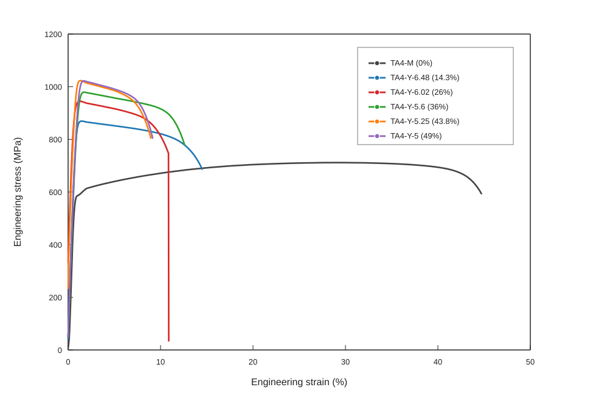
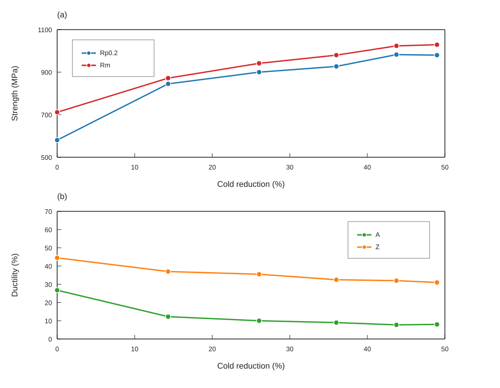
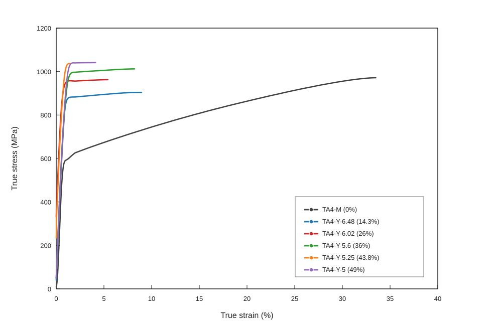
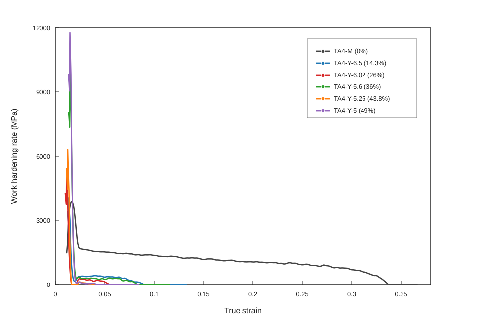
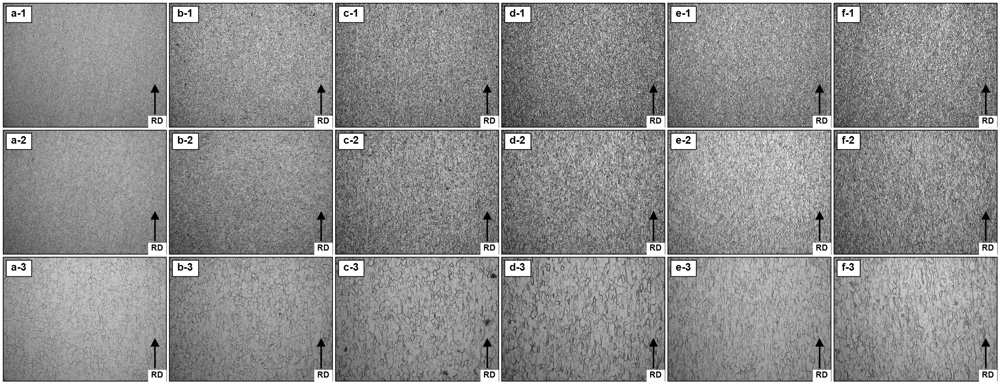
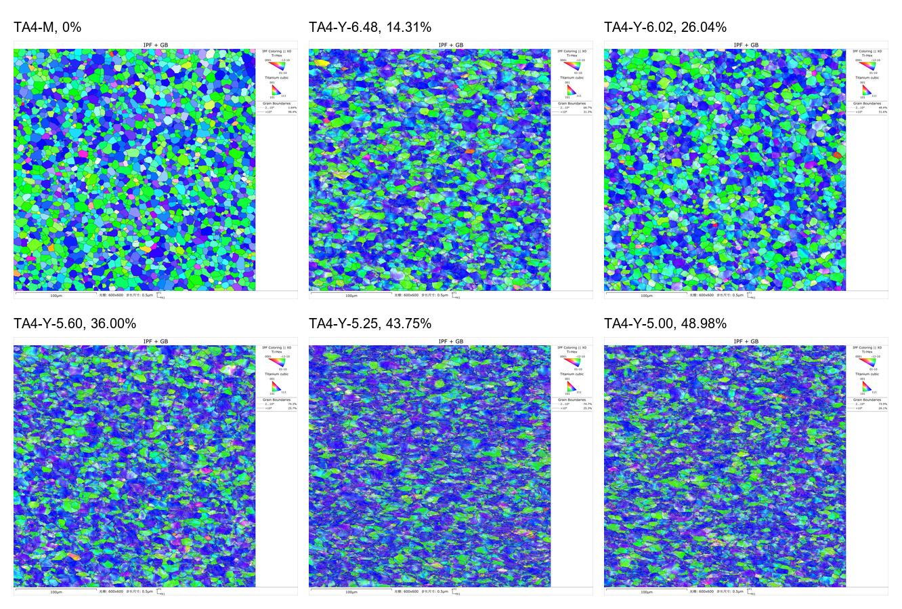
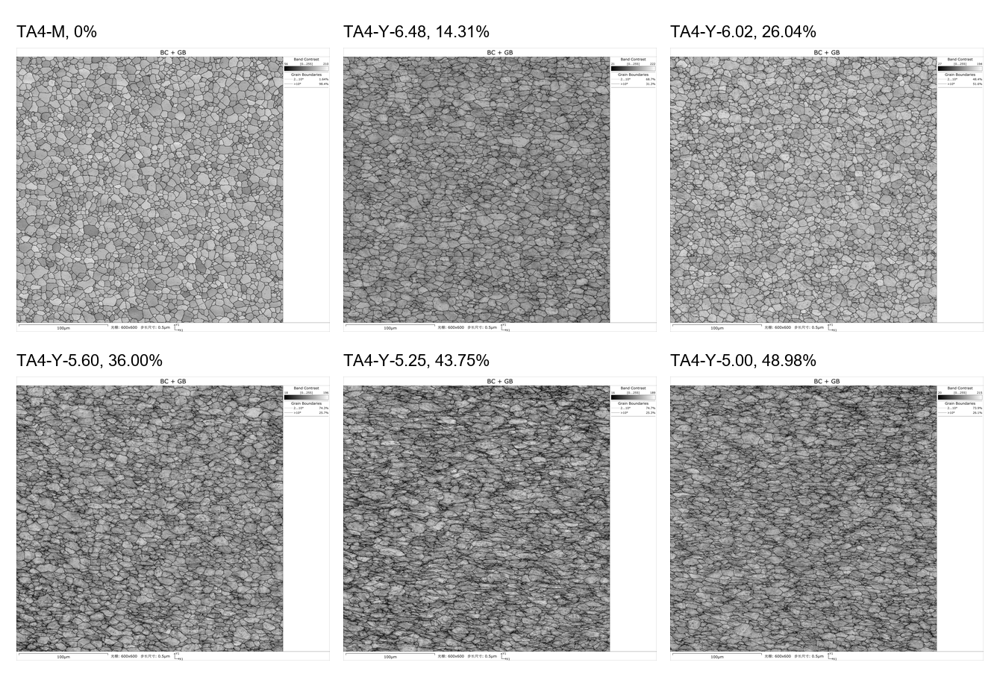
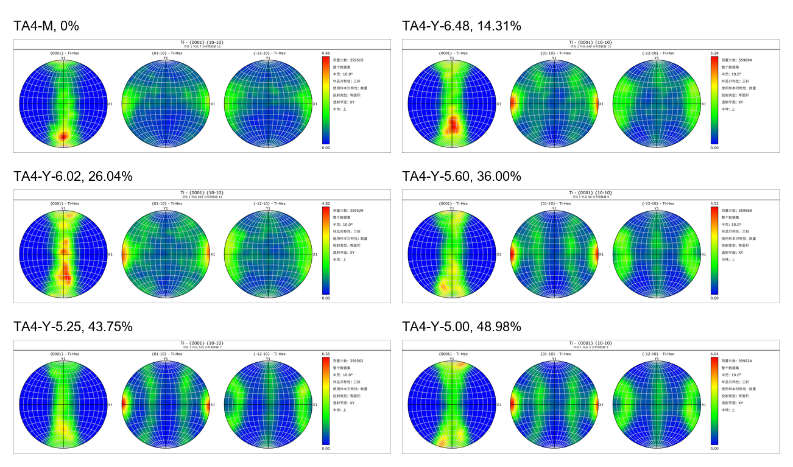

# 旋锻冷变形 TA4 商业纯钛的加工硬化行为与组织机制

摘要：为阐明旋锻冷变形对 TA4 商业纯钛强塑性匹配及加工硬化行为的影响，本文以初始直径 7 mm 的 TA4 商业纯钛棒材为研究对象，制备不同直径的旋锻冷变形样品，并结合室温拉伸试验、真实应力-应变分析、加工硬化率计算、金相组织观察和 EBSD 表征，分析冷变形量、力学响应与组织演化之间的关系。结果表明，随冷变形量由 0 增加至 48.98%，材料屈服强度由 580.5 MPa 提高至 980.0 MPa，抗拉强度由 711.5 MPa 提高至 1029.0 MPa；断后伸长率由 26.75% 降低至 8.00%，断面收缩率由 44.5% 降低至 31.0%。真实应力-应变曲线和加工硬化率曲线表明，旋锻预变形使材料进入较高强度状态，同时缩短后续均匀塑性变形区间并降低继续加工硬化的空间。金相和 EBSD 结果显示，冷变形后晶粒由近等轴形貌逐渐转变为沿棒材轴向拉长的变形组织，2°-15° 低角度取向差比例整体升高，说明冷变形引起的位错储存、晶界或亚晶界阻碍以及组织定向演化共同影响材料的强度提升和塑性降低。

关键词：TA4；商业纯钛；旋锻；冷变形；加工硬化；EBSD

## Work Hardening Behavior and Microstructural Mechanism of Rotary-swaged TA4 Commercially Pure Titanium

ABSTRACT: To clarify the effects of rotary-swaging cold deformation on the strength, ductility and work-hardening behavior of TA4 commercially pure titanium, TA4 bars with an initial diameter of 7 mm were rotary swaged at room temperature to obtain samples with cold reduction ranging from 0 to 48.98%. Room-temperature uniaxial tensile tests were conducted to analyze the engineering stress-strain response and mechanical properties. The engineering stress-strain data were converted into true stress-true strain data to calculate the work-hardening rate. Optical metallography and EBSD characterization were used to examine the relationship between microstructural evolution and mechanical response. The results show that, as the cold reduction increased from 0 to 48.98%, the yield strength increased from 580.5 MPa to 980.0 MPa and the tensile strength increased from 711.5 MPa to 1029.0 MPa, whereas the elongation after fracture decreased from 26.75% to 8.00% and the reduction of area decreased from 44.5% to 31.0%. The true stress-true strain curves and work-hardening rate curves indicate that cold-deformed samples exhibited higher initial flow stress while showing a reduced uniform plastic deformation range and work-hardening capacity during subsequent tensile loading. Metallographic and EBSD results show that the initially equiaxed or nearly equiaxed grains gradually transformed into elongated deformation structures along the bar axis, accompanied by an overall increase in the fraction of 2°-15° low-angle misorientations. The strength increase is mainly associated with deformation-induced dislocation storage, grain-boundary or sub-boundary impediment, and directional evolution of grain morphology.

Key words: TA4; commercially pure titanium; rotary swaging; cold deformation; work-hardening rate; EBSD

钛及钛合金具有密度低、比强度高、耐腐蚀性能良好和生物相容性优异等特点，在航空航天、海洋工程、化工装备和生物医用等领域具有重要应用价值。与钢铁和镍基合金等结构材料相比，钛合金能够在减重、耐蚀和复杂服役环境适应性方面表现出明显优势。然而，钛及钛合金也存在弹性模量较低、室温塑性变形协调性受晶体结构影响较大、加工成本较高等不足；对于承载构件和细径棒材，强度、塑性和加工可控性之间的匹配仍是材料设计与工艺调控中的重要问题。

商业纯钛不依赖大量合金元素即可获得较好的耐蚀性、成形性和生物相容性，因而在化工、海洋工程、医疗器械和一般耐蚀结构件中得到广泛应用。与多组元钛合金相比，商业纯钛成分相对简单，组织演化和变形机制更便于与加工历史建立对应关系，也有利于降低合金元素引入带来的成本和服役环境适应性问题。但商业纯钛的强度水平通常低于强化型钛合金，在需要较高承载能力或尺寸受限的应用场景中，单纯依靠原始退火或加工态组织往往难以同时满足强度和塑性要求。因此，如何在保持商业纯钛耐蚀性和加工适应性的基础上提高其强度，并合理控制塑性损失，是其工程应用中需要关注的问题。

冷变形是提高商业纯钛强度和调控组织状态的重要途径。对于棒材或线材构件，旋锻等冷加工方法能够通过连续径向压缩和轴向延伸实现截面减缩，使材料在室温下发生塑性变形并形成加工硬化组织。冷变形强化通常与位错累积、晶粒形貌拉长、晶界或亚晶界阻碍以及晶体取向演化等因素有关；对于密排六方结构的 α-Ti，滑移系启动能力与晶体取向密切相关，因此冷变形后的组织取向、局部取向差和变形不均匀性会共同影响后续拉伸过程中的屈服响应、加工硬化能力和塑性变形空间。与此同时，冷变形在提高强度的同时往往伴随延性下降，较高预变形量还可能使后续均匀塑性变形区间缩短，从而造成强度提升与塑性保持之间的矛盾。

已有研究对冷变形纯钛的强度提高、晶粒形貌变化或织构演化进行了讨论，为理解冷加工过程中的组织演变提供了重要基础。然而，对于旋锻态商业纯钛棒材而言，仅以强度或延伸率变化评价冷加工效果，难以充分说明截面减缩程度对后续拉伸变形能力、加工硬化空间和组织演化特征的共同影响。尤其是不同冷变形量下，拉伸响应的变化是否能够与真实应力-应变行为、加工硬化率曲线以及金相和 EBSD 证据相互对应，仍需进一步阐明。

本文以 TA4 商业纯钛棒材为研究对象，通过室温旋锻获得不同冷变形量样品，首先建立旋锻后直径、截面减缩率与拉伸性能之间的对应关系，随后结合真实应力-应变分析和加工硬化率计算评价预变形对后续塑性变形能力的影响，并进一步利用金相组织观察和 EBSD 表征分析冷变形组织证据。在此基础上，讨论冷变形诱导强度提升、塑性降低及加工硬化能力变化的组织机制，为商业纯钛冷加工工艺设计和强塑性匹配调控提供实验依据。

## 1 实验材料与方法

### 1.1 实验材料

实验材料为 M 态 TA4 商业纯钛棒材，由宁夏中色金航钛业有限公司提供，初始规格直径为 7 mm。为降低批次差异对冷变形行为和拉伸性能的影响，本文所用试样均取自同一批次棒材。

### 1.2 实验方法

原始棒材经外观检查后截取为旋锻用坯料，保留部分棒材作为未变形对照样品，记为 TA4-M；其余棒材经室温旋锻冷变形加工至不同直径。旋锻后测量棒材直径，并按测量得到的直径对样品进行分组和命名，旋锻态样品记为 TA4-Y-d，其中 d 表示旋锻后的测量直径，单位为 mm。旋锻加工后未进行中间退火或其他热处理。

根据旋锻后棒材直径测量结果，旋锻态样品分为 6.48、6.02、5.60、5.25 和 5.00 mm 五组，分别记为 TA4-Y-6.48、TA4-Y-6.02、TA4-Y-5.60、TA4-Y-5.25 和 TA4-Y-5.00。各组拉伸试样在试验前测量初始直径，并将该测量值用于截面积和力学性能计算；7 mm 原始态样品的拉伸试样初始直径测量平均值为 6.96 mm。

冷变形量采用旋锻前后棒材横截面积缩减率表征，按式（1）计算：

```text
ψ = (A0 - A1) / A0 × 100% = (D0^2 - D1^2) / D0^2 × 100%    （1）
```

式中，A0 和 A1 分别为旋锻前、后的横截面积，D0 和 D1 分别为旋锻前、后的棒材直径。以 D0 = 7 mm 作为参考直径计算，各样品组的冷变形量分别为 0、14.31%、26.04%、36.00%、43.75% 和 48.98%。该计算方式能够将不同直径样品的几何变化统一为截面减缩程度，便于进一步比较其拉伸响应和加工硬化行为。

对不同状态的棒材进行室温单轴拉伸试验。各直径组均设置多根平行试样，试样原始标距 L0 和引伸计标距 Le 均为 50 mm。拉伸试样沿棒材轴向制取，并按照 GB/T 228.1-2010 标准加工。拉伸试验在 INSTRON 5582 型电子万能试验机上进行，根据拉伸试验结果获得不同状态样品的工程应力-应变曲线，并由拉伸曲线获得抗拉强度 Rm、0.2% 偏移屈服强度 Rp0.2、断后伸长率 A 和断面收缩率 Z 等主要力学性能参数。各组力学性能结果采用平行试样的算术平均值表示。

为进一步分析拉伸变形过程中的加工硬化行为，将工程应力-应变数据换算为真实应力-真实应变数据。均匀变形阶段真实应力和真实应变按 σt = σe(1 + εe) 和 εt = ln(1 + εe) 计算。加工硬化率 θ 按真实应力对真实应变的一阶导数计算，即 θ = dσ/dε。由于上述换算关系适用于颈缩前的均匀变形阶段，本文主要选取屈服后至抗拉强度对应应变之前的塑性变形区间进行加工硬化率分析；颈缩后的曲线变化仅用于辅助判断断裂前表观变形能力。计算时先以 0.00025 的真实应变间隔对真实应力-真实应变曲线进行线性重采样，再采用 0.0025 真实应变宽度的移动平均进行平滑处理，并采用 0.002 真实应变半宽的中心差分方法求取 θ，以降低原始采样噪声对导数曲线的影响。

为分析旋锻冷变形对 TA4 商业纯钛组织演化的影响，分别选取 TA4-M 及不同 TA4-Y-d 样品进行金相观察和 EBSD 表征。金相样品取自棒材纵截面，经切取、镶嵌、磨抛后采用 Kroll 试剂腐蚀，并在 100×、200× 和 500× 放大倍数下观察晶粒形貌、变形流线和组织均匀性。

EBSD 表征样品与金相观察样品的状态保持一致，覆盖 TA4-M、TA4-Y-6.48、TA4-Y-6.02、TA4-Y-5.60、TA4-Y-5.25 和 TA4-Y-5.00 等不同冷变形量组。EBSD 样品经机械抛光和电解抛光进行表面处理，以降低机械制样引入的表层变形。EBSD 表征用于分析不同冷变形量下的晶粒形貌、晶体取向、晶界特征和局部取向差等组织信息；其中晶粒尺寸采用等效圆直径的面积加权分布表征，取向差分布采用邻近点取向差统计进行比较。

## 2 结果与分析

### 2.1 冷变形量与拉伸性能

根据式（1）计算，未变形样品与旋锻态样品的直径分组分别为 7.00、6.48、6.02、5.60、5.25 和 5.00 mm，对应冷变形量分别为 0、14.31%、26.04%、36.00%、43.75% 和 48.98%。该系列样品能够反映截面减缩程度连续增加时 TA4 商业纯钛拉伸响应和加工硬化行为的变化。

根据室温单轴拉伸试验获得的载荷-位移数据，结合试样原始截面积和标距换算得到工程应力-应变曲线。为比较不同冷变形量下 TA4 商业纯钛的拉伸响应，选取各样品组的代表性工程应力-应变曲线进行汇总。如图 1 所示，未变形样品 TA4-M 的应力水平较低，断裂前具有较长的塑性变形阶段；经旋锻冷变形后，各样品曲线整体向高应力水平移动，且屈服后的塑性变形区间明显缩短。该结果表明，旋锻冷变形提高了材料抵抗塑性变形的能力，同时降低了后续拉伸过程中的塑性变形空间。



图 1 不同冷变形量 TA4 商业纯钛样品的代表性工程应力-应变曲线

由工程应力-应变曲线获得的主要力学性能参数见表 1。随冷变形量由 0 增加至 48.98%，TA4 商业纯钛的屈服强度由 580.5 MPa 提高至 980.0 MPa，抗拉强度由 711.5 MPa 提高至 1029.0 MPa，说明旋锻冷变形显著提高了材料的屈服抗力和最大承载能力。与此同时，断后伸长率由 26.75% 降低至 8.00%，断面收缩率由 44.5% 降低至 31.0%，表明材料整体塑性和断裂前局部塑性变形能力均随冷变形量增加而下降。

| 样品名称 | 冷变形量/% | 屈服强度 Rp0.2/MPa | 抗拉强度 Rm/MPa | 断后伸长率 A/% | 断面收缩率 Z/% |
|---|---:|---:|---:|---:|---:|
| TA4-M | 0.00 | 580.5 | 711.5 | 26.75 | 44.5 |
| TA4-Y-6.48 | 14.31 | 845.0 | 872.0 | 12.25 | 37.0 |
| TA4-Y-6.02 | 26.04 | 900.0 | 941.5 | 10.00 | 35.5 |
| TA4-Y-5.60 | 36.00 | 927.0 | 980.0 | 9.00 | 32.5 |
| TA4-Y-5.25 | 43.75 | 982.5 | 1023.5 | 7.75 | 32.0 |
| TA4-Y-5.00 | 48.98 | 980.0 | 1029.0 | 8.00 | 31.0 |

表 1 不同冷变形量 TA4 商业纯钛样品的力学性能

为进一步体现强度和塑性指标随冷变形量的变化规律，将屈服强度、抗拉强度、断后伸长率和断面收缩率绘制于同一图中。如图 2(a) 所示，屈服强度和抗拉强度均随冷变形量增加而整体升高，其中抗拉强度保持较为连续的上升趋势；屈服强度在 43.75% 和 48.98% 冷变形量之间出现局部差异，说明高变形量区间的屈服响应存在一定非单调变化。如图 2(b) 所示，断后伸长率和断面收缩率随冷变形量增加整体下降，表明旋锻冷变形在提高材料强度的同时降低了断裂前的塑性变形能力。



图 2 不同冷变形量 TA4 商业纯钛样品的力学性能指标变化：（a）强度指标；（b）塑性指标

### 2.2 加工硬化行为

工程应力-应变曲线能够反映不同冷变形量样品的宏观拉伸响应，但加工硬化行为需要结合真实应力-真实应变关系进一步分析。根据工程应力-应变数据换算得到代表性真实应力-真实应变曲线。如图 3 所示，冷变形样品在拉伸初期即表现出较高的真实应力水平，说明预先旋锻变形已使材料处于较高的加工硬化状态。随着冷变形量增加，曲线可持续发展的真实应变范围缩短，表明高变形量样品在后续单轴拉伸过程中可继续储存位错并发生均匀塑性变形的空间受到限制。



图 3 不同冷变形量 TA4 商业纯钛样品的代表性真实应力-真实应变曲线

根据真实应力-真实应变曲线计算得到的加工硬化率 θ = dσ/dε。如图 4 所示，各样品加工硬化率随真实塑性应变增加整体呈下降趋势；冷变形量较高的样品曲线分布区间明显缩短，说明预变形后材料的后续加工硬化空间降低。



图 4 不同冷变形量 TA4 商业纯钛样品的代表性加工硬化率曲线

### 2.3 微观组织

为分析旋锻冷变形后力学响应变化的显微组织来源，对不同冷变形量样品的纵截面金相组织进行观察。图 5 中，棒材轴向（axial direction, AD）为旋锻过程中材料发生轴向延伸的加工方向；a-f 分别对应 TA4-M、TA4-Y-6.48、TA4-Y-6.02、TA4-Y-5.60、TA4-Y-5.25 和 TA4-Y-5.00，1-3 分别对应 100×、200× 和 500×。如图 5 所示，未变形样品 TA4-M 的显微组织主要由较均匀的等轴或近等轴晶粒组成，晶界轮廓较清晰，整体未表现出明显的定向拉长特征。经旋锻冷变形后，晶粒形貌开始发生定向变化，部分晶粒沿 AD 方向被拉长，纵截面组织逐渐呈现沿轴向分布的流线化特征。随着旋锻后直径进一步降低，晶粒拉长和带状化特征更加明显，等轴晶形貌逐渐减弱，说明冷变形使原始组织发生了明显的定向塑性变形。

从不同放大倍数的对比可以看出，100× 和 200× 图像主要反映整体组织均匀性和流线化程度，500× 图像则更清楚地显示晶粒边界形貌和晶粒拉长特征。TA4-M 样品在高倍下仍以近等轴晶为主；而较高冷变形量样品中，晶粒沿 AD 方向延伸，晶界呈现一定弯曲和拉伸特征，表明塑性变形在晶粒内部及晶界附近持续累积。该组织演化与拉伸曲线中强度升高和塑性区间缩短的现象相对应，其作用可能与位错累积、晶界对位错运动的阻碍以及变形过程中晶粒取向调整有关。



图 5 不同冷变形量 TA4 商业纯钛样品的纵截面金相组织：（a）TA4-M；（b）TA4-Y-6.48；（c）TA4-Y-6.02；（d）TA4-Y-5.60；（e）TA4-Y-5.25；（f）TA4-Y-5.00；（1）100×；（2）200×；（3）500×。

### 2.4 EBSD 取向与局部变形特征

为进一步分析冷变形组织与力学性能之间的关系，对不同冷变形量样品进行 EBSD 表征。图 6 为不同样品的 IPF+晶界图，图 7 为 BC+晶界图，图 8 为基面极图，表 2 为基于 EBSD 输出文件整理得到的等效圆直径和邻近点取向差统计结果。未变形 TA4-M 样品的晶粒以近等轴形貌为主，晶界网络相对清晰；经旋锻冷变形后，IPF 图中晶粒形貌逐渐表现出沿棒材轴向拉长和取向分布局部集中的特征，与金相组织中观察到的流线化和带状化趋势一致。



图 6 不同冷变形量 TA4 商业纯钛样品的 EBSD IPF+晶界图

BC+晶界图进一步反映了冷变形后扫描区域内的局部变形衬度和晶界形貌变化。未变形样品的带衬度分布相对均匀，晶界轮廓较完整；随冷变形量增加，图中沿轴向分布的变形带状特征和局部衬度差异增强，说明旋锻过程中塑性变形在晶粒内部及晶界附近持续累积，并使组织呈现更明显的方向性。该结果与 IPF 图和金相组织中观察到的晶粒拉长现象相互印证。



图 7 不同冷变形量 TA4 商业纯钛样品的 EBSD BC+晶界图

极图结果显示，不同冷变形量样品的晶体取向分布随旋锻变形发生调整。未变形样品已具有一定取向分布特征；冷变形后，(0001) 与 {10-10} 极图中的强度分布位置和集中程度发生变化，说明旋锻过程中晶粒转动和取向重新分布参与了组织演化，并与晶粒形貌定向拉长和局部取向差增加共同反映冷变形组织的方向性演变。



图 8 不同冷变形量 TA4 商业纯钛样品的 EBSD 极图

由表 2 可知，未变形样品中 2°-15° 低角度取向差比例较低，仅为 3.88%；旋锻冷变形后，该比例整体升高，在 36.00%、43.75% 和 48.98% 冷变形量样品中分别达到 42.45%、54.29% 和 49.28%。低角度取向差比例的增加说明冷变形过程中晶粒内部取向梯度和亚结构特征增强，可作为位错储存和局部塑性变形不均匀增加的 EBSD 证据。26.04% 冷变形量样品的低角度取向差比例低于相邻变形量样品，说明 EBSD 统计结果存在一定局部差异，后续机制讨论应结合取样位置、扫描区域和拉伸曲线可靠性综合判断。

面积加权等效圆直径在 8.11-11.15 μm 范围内变化，未表现出随冷变形量增加而单调减小的趋势。因此，本文不将晶粒细化作为强度提升的主要依据，而重点关注冷变形引起的晶粒形貌定向演化、低角度取向差比例增加以及由此反映的位错储存和亚结构形成。由于当前 EBSD 输出尚未给出 KAM、GND 密度、孪生体积分数或特定滑移系活动的定量结果，相关内容不作为确定性结论。

| 样品名称 | 冷变形量/% | 面积加权等效圆直径/μm | 2°-15° 低角度取向差比例/% | ≥15° 高角度取向差比例/% |
|---|---:|---:|---:|---:|
| TA4-M | 0.00 | 8.11 | 3.88 | 96.12 |
| TA4-Y-6.48 | 14.31 | 9.16 | 28.90 | 71.10 |
| TA4-Y-6.02 | 26.04 | 8.61 | 11.37 | 88.63 |
| TA4-Y-5.60 | 36.00 | 9.99 | 42.45 | 57.55 |
| TA4-Y-5.25 | 43.75 | 11.15 | 54.29 | 45.71 |
| TA4-Y-5.00 | 48.98 | 9.87 | 49.28 | 50.72 |

表 2 不同冷变形量 TA4 商业纯钛样品的 EBSD 派生统计结果

### 2.5 冷变形强化与塑性损失机制

综合拉伸性能、真实应力-应变曲线、加工硬化率曲线和显微组织表征结果，旋锻冷变形对 TA4 商业纯钛的影响可归纳为强度提高、塑性降低和后续加工硬化空间缩短三个方面。随冷变形量增加，屈服强度和抗拉强度整体升高，说明预先引入的塑性变形提高了材料后续拉伸所需的流动应力；断后伸长率和断面收缩率整体下降，则表明材料继续发生均匀塑性变形和局部塑性协调的能力受到削弱。真实应力-应变曲线和加工硬化率曲线进一步说明，冷变形样品在拉伸初期已处于较高加工硬化状态，高变形量样品可继续加工硬化的应变区间明显缩短。

上述力学响应与金相和 EBSD 表征结果具有对应关系。金相组织显示，随冷变形量增加，TA4 商业纯钛的晶粒由近等轴形貌逐渐转变为沿 AD 方向拉长的变形组织，表明塑性变形在轴向加工过程中持续累积，并使组织方向性增强。EBSD 的 IPF+晶界图和 BC+晶界图显示，冷变形后晶粒拉长、局部变形衬度差异和取向不均匀性增强；极图结果进一步说明晶体取向分布随旋锻变形发生调整。EBSD 统计显示，2°-15° 低角度取向差比例由未变形样品的 3.88% 整体升高至高变形量样品的 49.28%-54.29%，说明冷变形促进晶内取向梯度和亚结构特征发展。上述结果表明，旋锻冷变形引起的位错储存、晶界或亚晶界阻碍以及组织定向演化共同参与强度提升，同时也降低了后续拉伸过程中的可变形能力。

对于高冷变形量样品中屈服强度和塑性指标的局部非单调变化，可结合 EBSD 局部组织特征进行分析。43.75% 与 48.98% 冷变形量样品的屈服强度接近，而 EBSD 统计中两者低角度取向差比例分别为 54.29% 和 49.28%，说明高变形量区间的局部组织状态并非严格单调变化。该差异可能与取样位置、扫描区域内局部变形程度和取向分布有关，也可能受到原始拉伸曲线屈服段识别的影响。相关机制解释应以金相、EBSD 统计和拉伸曲线可靠性为依据，并避免将尚未直接证实的孪生或特定滑移机制作为确定结论。

## 3 结论

1）旋锻冷变形显著提高了 TA4 商业纯钛的强度。随冷变形量由 0 增加至 48.98%，屈服强度由 580.5 MPa 提高至 980.0 MPa，抗拉强度由 711.5 MPa 提高至 1029.0 MPa；与此同时，断后伸长率由 26.75% 降低至 8.00%，断面收缩率由 44.5% 降低至 31.0%，表现出明显的强度升高和塑性降低特征。

2）真实应力-真实应变曲线表明，冷变形样品在拉伸初期即处于较高流动应力水平，且随冷变形量增加，后续可持续塑性变形区间缩短。加工硬化率曲线整体随真实塑性应变增加而下降，高冷变形量样品的曲线分布区间明显缩短，说明预变形降低了后续拉伸过程中的加工硬化空间。

3）金相组织显示，TA4 商业纯钛经旋锻冷变形后，晶粒由较均匀的等轴或近等轴形貌逐渐转变为沿 AD 方向拉长的变形组织，流线化和带状化特征随冷变形量增加而增强。EBSD 的 IPF+晶界图、BC+晶界图和极图显示，冷变形后晶粒形貌、局部变形衬度和取向分布均发生变化；高变形量样品中 2°-15° 低角度取向差比例明显高于未变形样品，说明冷变形使晶内取向梯度和亚结构特征增强。

4）TA4 商业纯钛的冷变形强化主要与位错储存、晶界或亚晶界阻碍以及晶粒形貌定向演化有关。当前 EBSD 结果能够支撑低角度取向差比例和晶粒形貌变化的讨论，但尚不足以定量给出 GND 密度、孪生体积分数或特定滑移系活动；对于偏离整体变化趋势的结果，应结合局部组织差异和拉伸曲线可靠性进行分析。

## 参考文献

【待补】按目标期刊格式整理。正文中每一处机制解释应对应实验数据或文献依据。